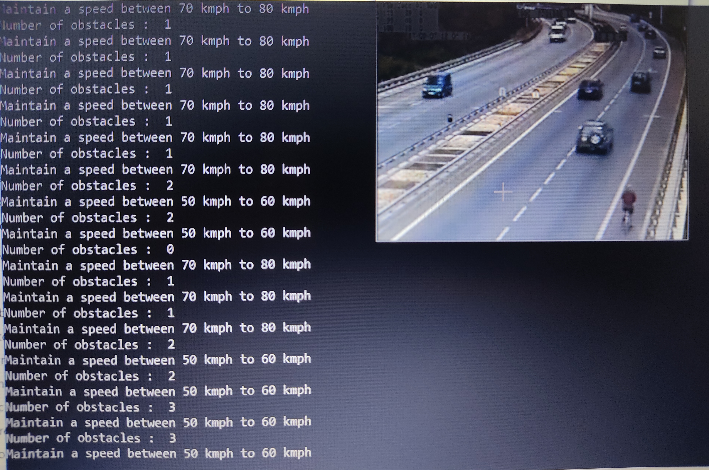
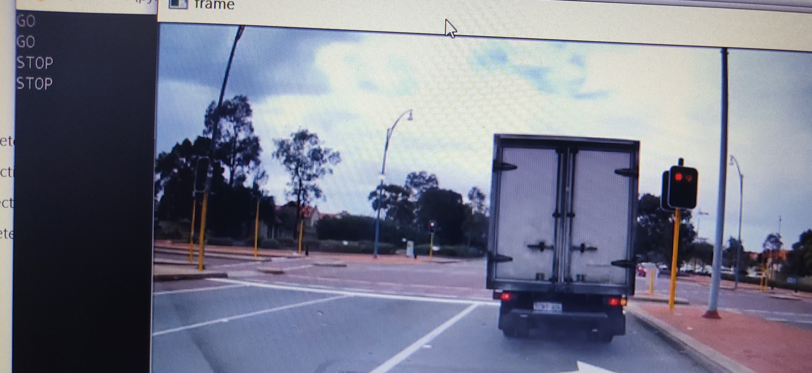
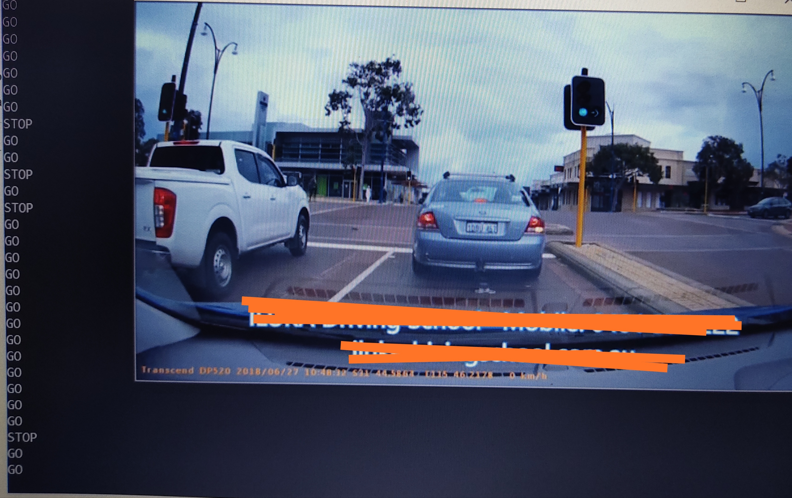
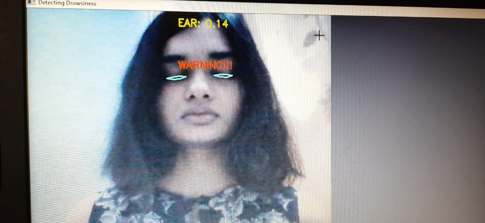

# Team Vision
## Automation of driverless cars and drowsiness detection in normal cars

### This project basically contains three parts such as obstacle detection and speed regulation, traffic light detection as well as drowsines detection.
### With this project we aim to automate driverless cars on roads and giving it proper signals so that it could operate safely as well as through drowsiness detection we aim to reduce accidents caused due to drowsiness of drivers.

#### The main tech stack we used in this project is OpenCV for object detection. 
#### We are using haar cascades to identify obstacles on roads such as vehicles, humans, etc and according to the number of obstacles a command is provided to maintain a speed in a specific range so that it could prevnt any mishappening on the road.

#### Traffic lights are also detected by masking the other regions and only focusing on what we want in that frame and thus providing the command whether to STOP, BE READY or GO according to the traffic lights detected respectively in that frame.

#### For drowsiness detection, we are also using dlib library which is is based on histogram of oriented gradients,and then indexes the significant facial features into 68 points(x,y coordinates).It is later then used to calculate EAR value through which we could identify whether the driver is drowsy or not and if he is then there is an alarm connected which will start to give warning signal thus waking up the driver and preventing an accident.

#### There are some drawbacks in this project when it will be used in real time and that drawback is the accuracy of the model, sometimes if fails to give proper command but still we are working on it and planning to use YOLO and CNN so that accuracy could be improved for usage in real life.
